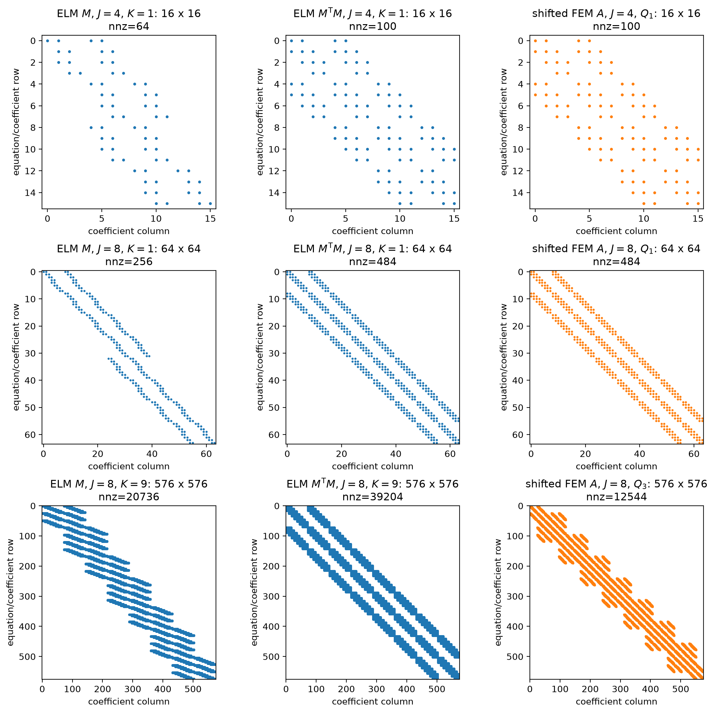
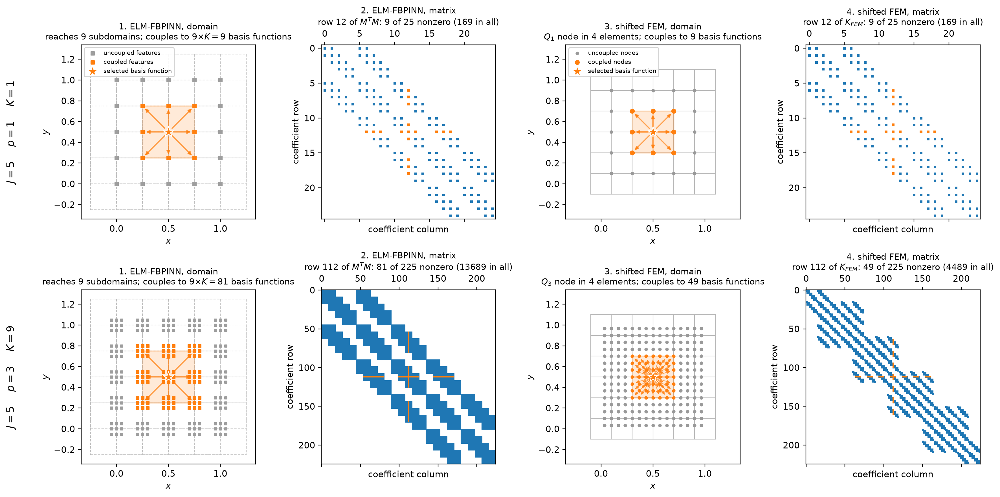
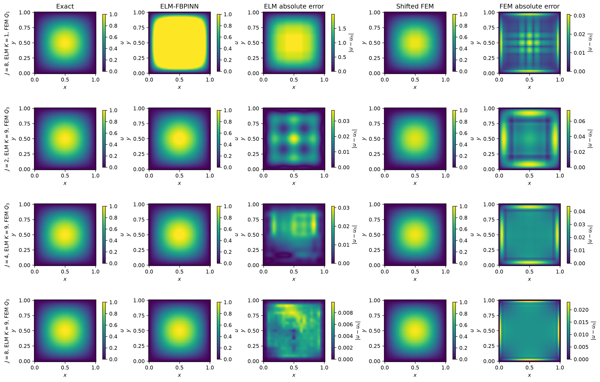
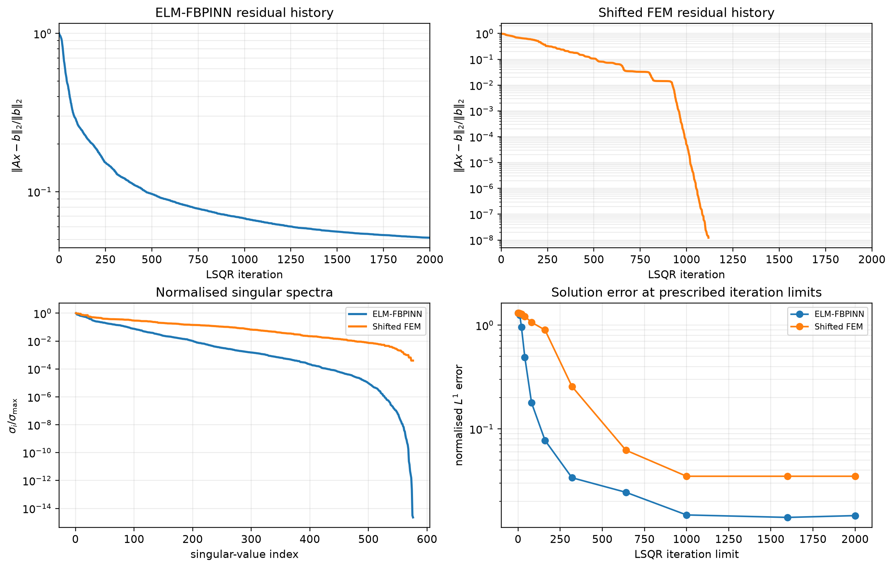
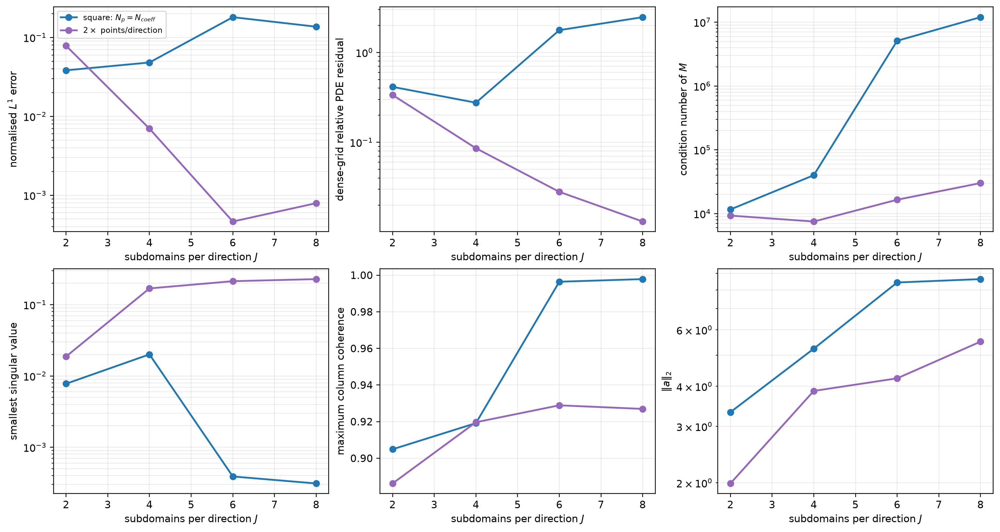
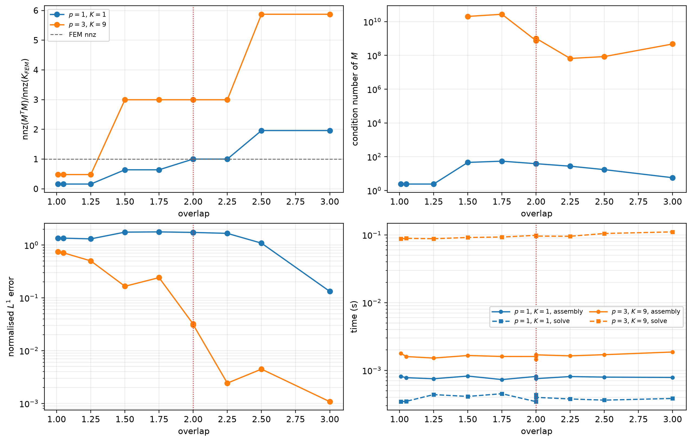
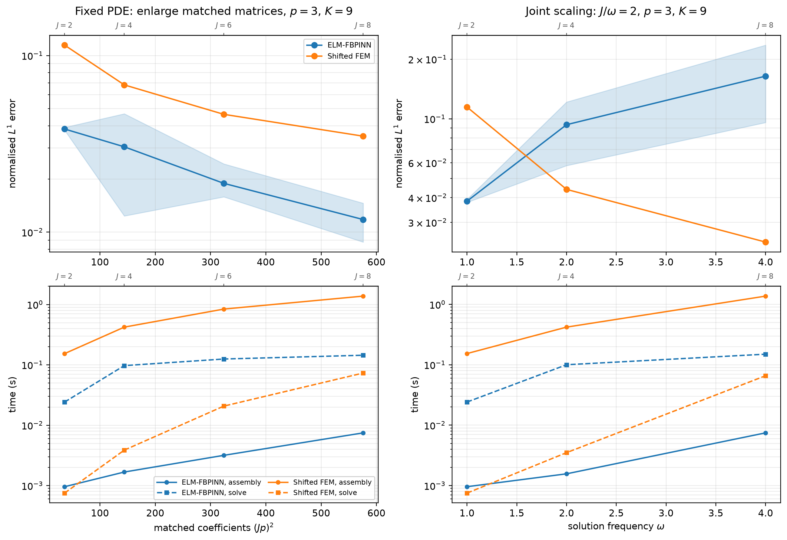
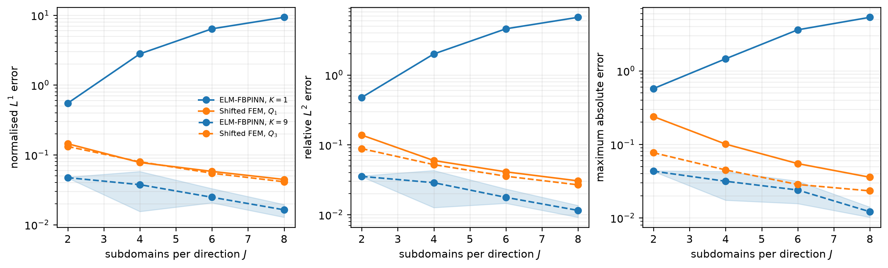

# A Robust Comparison of ELM–FBPINNs and FEM for Solving PDEs

This repository contains the code accompanying the MSc thesis
*A Robust Comparison of ELM–FBPINNs and FEM for Solving PDEs*. The project asks whether a
strong-form extreme-learning-machine finite-basis physics-informed neural network
(ELM–FBPINN) and the finite element method (FEM) can first be placed in a common mathematical
framework, how closely they can then be aligned, and which differences still control their
accuracy, efficiency and matrix structure.

The thesis was completed as part of the MSc Applied Mathematics programme at Imperial College
London under the supervision of Dr Ben Moseley and Sean De Marco.

The comparison uses manufactured two-dimensional Poisson and Helmholtz problems. It is not a
contest between two fully optimised solvers. Instead, it is a controlled numerical experiment
designed to expose how trial functions, support, collocation, enrichment and conditioning affect
the two discretisations.

The principal contribution is a common coefficient-functional description. Both methods are
written as global sums of local trial functions whose coefficients are selected by equation
functionals. This makes their trial spaces, support interactions, equation placement and matrix
structure directly comparable without treating strong collocation and weak Galerkin testing as
the same operation.

## Controlled construction

The two methods are aligned through their spatial locations and algebraic budgets. Let $J$ be the
number of ELM subdomains per coordinate direction and let $p$ be an odd FEM polynomial degree.
Choosing $K=p^2$ local ELM features gives

$$
N_{\mathrm{ELM}}=J^2K=(Jp)^2,
\qquad
N_{\mathrm{FEM}}=(Jp)^2,
\qquad
N_{\mathrm{physics}}=(Jp)^2.
$$

Thus the ELM–FBPINN and shifted FEM have the same numbers of solved coefficients and equations.
The FEM mesh is shifted by half an element so that its active nodes coincide with the ELM
collocation points,

$$
x_i=\frac{i+\tfrac12}{Jp},
\qquad i=0,\ldots,Jp-1.
$$

Both methods use the same physical problem, hard boundary factor, coefficient and equation
budgets, spatial locations, LSQR controls, evaluation grid and error measures. The remaining
differences are deliberate: ELM–FBPINN uses overlapping windows, fixed local features and
strong-form collocation, whereas FEM uses a polynomial nodal basis and weak Galerkin testing.

The nominal overlap factor of two is implemented as $1.999$. This small perturbation avoids an
exact support-boundary coincidence being decided by floating-point round-off and does not define
a meaningfully different geometric regime.

## Research questions

1. Can ELM–FBPINN and FEM be brought under a common mathematical framework and aligned for a
   controlled comparison, and which mechanisms remain different after matching?
2. How do their accuracy and efficiency change under fixed-PDE refinement and joint
   capacity–complexity scaling?
3. How do local enrichment, feature family, overlap and sampling affect accuracy, cost and matrix
   structure, how are these effects related to conditioning, and which design ideas are
   transferable between the frameworks?

## Main findings

### Matching dimensions does not make the methods equivalent

At $K=1$, each ELM subdomain contributes one constant feature. With the matched point placement,
the ELM normal matrix and shifted-Q<sub>1</sub> FEM matrix have the same tested binary coefficient graph.
Their entries and spectra still differ because one comes from sampled strong-form residuals and
the other from weak-form integration.

[](figures/coefficient_matrices_combined.png)

The domain-connectivity view explains this pattern physically. At $K=1$, one ELM window and
one shifted-Q<sub>1</sub> FEM basis function each couple to nine coefficients. After enrichment,
all nine ELM features on every reached subdomain share the same window support, giving 81
coupled coefficients, whereas the node-dependent shifted-Q<sub>3</sub> FEM supports couple to 49.
Matching $K=p^2$ therefore preserves the total coefficient count but not the enriched support
graph.

[](figures/domain_connectivity.png)

### Local enrichment is essential

The one-feature ELM space has no local shape freedom and becomes worse under refinement. Using
$K=9$ adds eight fixed tanh features per subdomain and turns this structural diagnostic into a
useful approximation space. On the fixed Poisson problem, the enriched ELM–FBPINN improves under
refinement and is more accurate than the matched shifted-Q<sub>3</sub> FEM throughout the tested range.

[](figures/poisson_solution_selected.png)

### Enrichment changes the algebraic problem

All ELM features on a subdomain share the same window support, producing dense local coefficient
blocks after enrichment. High-order FEM basis functions instead have node-dependent supports.
The enriched ELM systems are consequently denser and develop a longer tail of poorly determined
directions, making LSQR convergence more difficult.

[](figures/convergence_conditioning_explanation.png)

### Algebraic residuals are system-specific diagnostics

Both methods use LSQR with the same tolerances and 2000-iteration budget, but their algebraic
residuals belong to fundamentally different equations: ELM–FBPINN uses strong-form collocation,
whereas FEM uses weak-form Galerkin testing. Residual histories therefore diagnose convergence
within each assembled system and should not be compared as though they were a common accuracy
measure. Reconstructed solution error on the shared test grid provides the fairer cross-method
comparison. The singular spectra explain why the enriched ELM system converges more slowly: its
shared-support feature blocks create a much longer tail of weakly determined directions.

### Sampling and overlap are not minor details

The deterministic polynomial experiment shows that a capable trial space can still fail when a
square collocation system does not constrain it reliably. Oversampling the same columns restores
the refinement trend and improves conditioning. The overlap sweep similarly shows that the
factor-of-two structural baseline is not the accuracy-optimal ELM choice: wider overlap can
substantially improve accuracy, at the cost of additional coupling.

[](figures/polynomial_refinement_diagnostics.png)

[](figures/overlap_sweep_diagnostics.png)

### The accuracy ranking depends on the scaling protocol

When the PDE is fixed and the coefficient budget grows, enriched ELM–FBPINN is more accurate in
the tested configurations. When solution frequency and model capacity increase together at fixed
$J/\omega=2$, that advantage disappears. This shows that matching parameter counts alone does not
guarantee that the local feature distribution remains suitable as the approximation problem
becomes more difficult.

[](figures/matched_scaling_accuracy_efficiency.png)

[](figures/helmholtz_error_refinement.png)

## Code structure

- `main.py` provides the command-line interface and full replication suite.
- `methods.py` contains the ELM–FBPINN and shifted-FEM discretisations, assembly, LSQR solves and
  comparison workflow.
- `domains.py` constructs the physical domain, FBPINN decomposition, shifted FEM mesh and matched
  point set.
- `problems.py` defines the manufactured Poisson and Helmholtz problems and their common hard
  boundary constraint.
- `plots.py` generates the principal result figures.
- `figures/` contains selected final figures used in the thesis, including the domain-connectivity
  schematic used to interpret the matrix structure.
- `requirements.txt` records the exact package versions and FBPINNs revision used for the final
  verification.

The implementation reuses the `fbpinns` and `elm` libraries for the rectangular decomposition,
cosine windows, local-coordinate normalisation, random-feature initialisation and ELM basis
evaluation. The matched assembly and FEM implementation remain local so that the comparison is
explicit and easy to inspect.

## Code provenance

- **Domain decomposition:** `domains.py` uses the subdomain-width calculation and rectangular decomposition from the [FBPINNs `elm-paper` branch](https://github.com/benmoseley/FBPINNs/tree/elm-paper).
- **ELM features and assembly:** `methods.py` uses the FBPINNs local normalisation, cosine windows, random-feature initialisation and tanh basis. Its JAX construction of the partitioned basis and strong-form matrix is a compact, problem-specific adaptation of [`elm/trainers.py`](https://github.com/benmoseley/FBPINNs/blob/elm-paper/elm/trainers.py), kept local so the matched rows, columns and point placement remain explicit.
- **Boundary constraint:** The product-of-tanh boundary factor and default scale of `0.2` follow the two-dimensional problem in [`elm-paper/problems.py`](https://github.com/benmoseley/FBPINNs/blob/elm-paper/elm-paper/problems.py).
- **Finite elements:** The FEM code was developed from the reference-element, Gauss-quadrature and local-to-global assembly structure in Sean De Marco's Julia [`2Dpois_FEM.jl`](https://github.com/SeanDeMarco/Physics-Informed-Extreme-Learning-Machines/blob/main/2Dpois_FEM.jl). This Python version extends it from a regular Q<sub>1</sub> mesh to the half-element-shifted Q<sub>p</sub> construction, shared hard boundary factor, sparse assembly and LSQR used in the thesis comparison.

## Related work and software

- [`elm-paper` branch of FBPINNs](https://github.com/benmoseley/FBPINNs/tree/elm-paper):
  the ELM–FBPINN implementation used by this project.
- [Sean De Marco, *Physics-Informed Extreme Learning Machines and Poisson baselines*](https://github.com/SeanDeMarco/Physics-Informed-Extreme-Learning-Machines):
  the Julia FEM baseline from which the element-integration and assembly workflow was developed.
- [Anderson et al., *ELM-FBPINNs: an efficient multilevel random feature method*](https://doi.org/10.1007/s44379-026-00071-1):
  the principal ELM–FBPINN paper and methodological starting point for this study.
- [Moseley et al., *Finite basis physics-informed neural networks*](https://doi.org/10.1007/s10444-023-10065-9):
  the overlapping domain-decomposition framework on which ELM–FBPINNs are built.
- [Huang et al., *Extreme learning machine: Theory and applications*](https://doi.org/10.1016/j.neucom.2005.12.126):
  the original ELM formulation based on fixed hidden parameters and solved output weights.
- [Grossmann et al., *Can physics-informed neural networks beat the finite element method?*](https://doi.org/10.1093/imamat/hxae011):
  an earlier PINN–FEM comparison that motivates the more controlled algebraic comparison here.
- [Sobh et al., *PINN–FEM: A hybrid approach for enforcing Dirichlet boundary conditions in physics-informed neural networks*](https://doi.org/10.48550/arXiv.2501.07765):
  a complementary hybrid method that transfers finite-element boundary treatment into PINNs.
- [van Beek et al., *Local feature filtering for scalable and well-conditioned domain-decomposed random feature methods*](https://doi.org/10.1016/j.cma.2025.118583):
  related work on conditioning and local feature filtering for domain-decomposed random-feature
  systems.

## Environment

The final clean-clone verification used Python 3.14.6. Exact tested package versions and the
specific FBPINNs `elm-paper` commit are recorded in `requirements.txt`. For a new environment:

```bash
python -m pip install -r requirements.txt
```

The implementation enables JAX 64-bit mode because the matrix diagnostics and least-squares
systems are sensitive to numerical precision.

The timing panels committed here use single runs on Imperial College London's Linux-based
Research Computing Service cluster. Timings are implementation-, hardware- and platform-dependent
and may differ when regenerated locally.

## Running the code

Run a small configurable comparison:

```bash
python main.py --J 2 4 --orders 1 3 --seeds 0 --test-grid 51
```

Run the principal numerical replication suite and generate its outputs directly in `figures/`:

```bash
python main.py --study thesis
```

The full suite covers Poisson and Helmholtz refinement, matrix patterns, conditioning,
polynomial oversampling, overlap sensitivity and joint capacity–complexity scaling.
It can take considerably longer than the small comparison because it includes larger systems and
dense condition-number calculations.

## Licence

This repository is available under the [MIT Licence](LICENSE). Adapted upstream components remain
subject to their original licences and are identified in the code-provenance section above.
